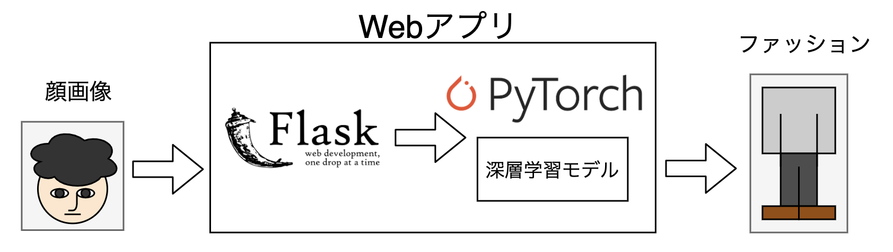
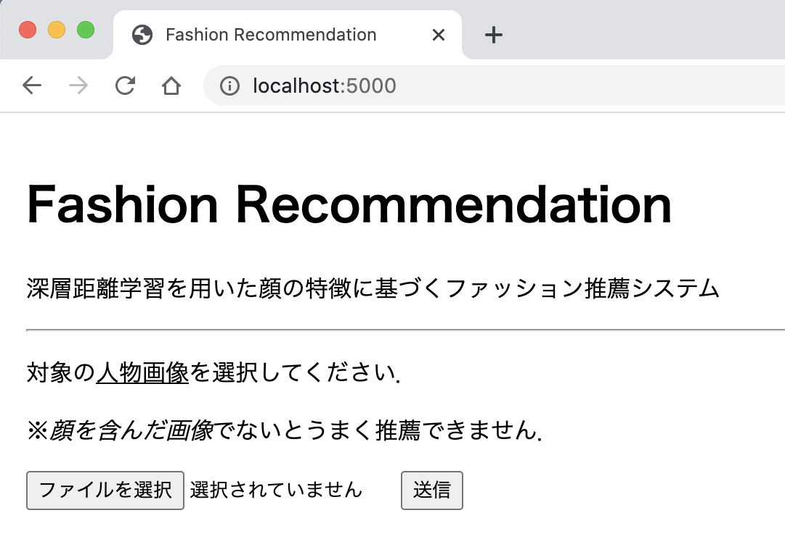
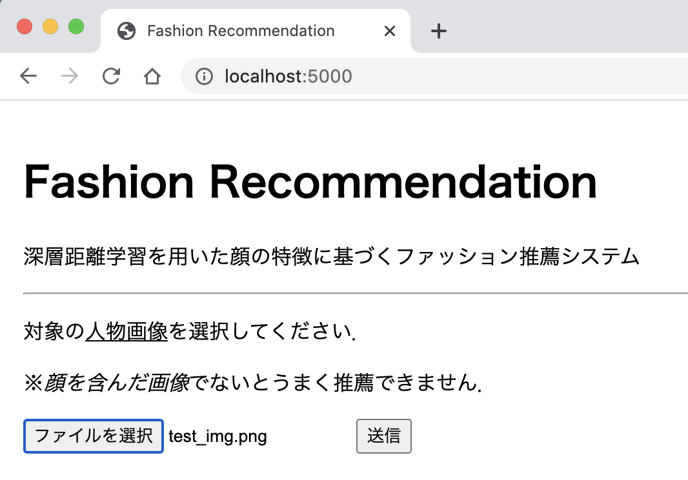
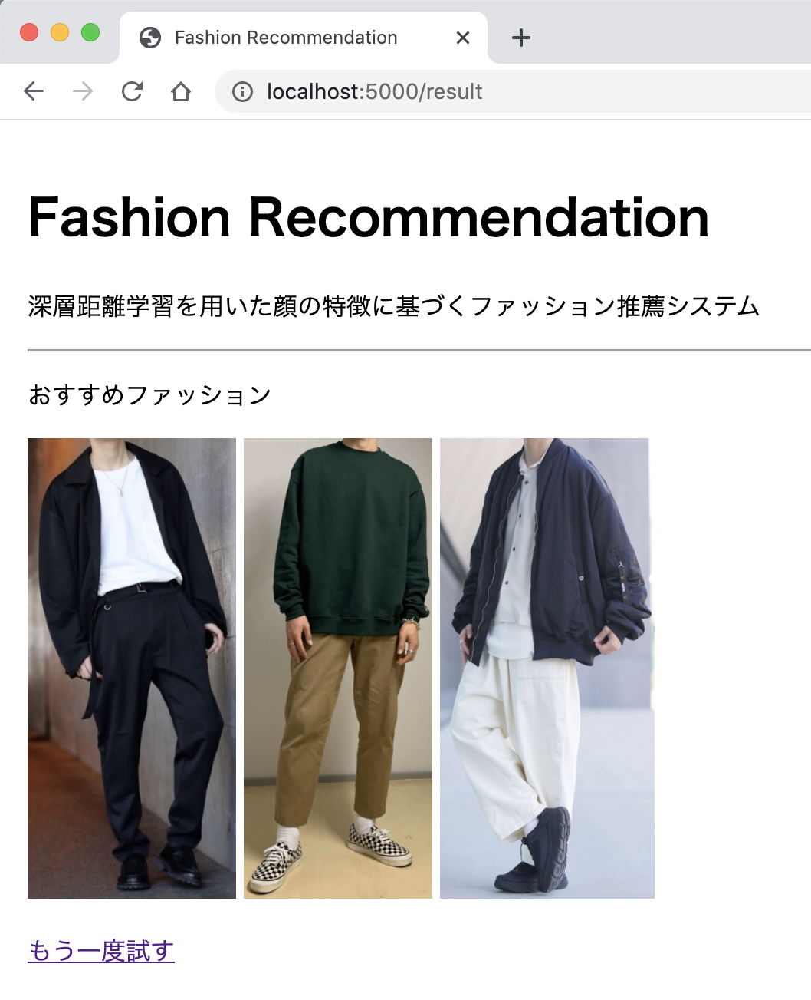

# WebApp-FashionRecommendation
深層距離学習を用いた顔の特徴に基づくファッション推薦Webアプリです．  
人物画像を入力することにより，その人物に似合うファッションの推薦を行います．  


## 実行方法
### 環境
システム開発/動作確認環境
- Python 3.6.8 
- MacOC Catalina (10.15.5)

ライブラリおよびフレームワークは以下を用いました．
* [Flask](https://flask.palletsprojects.com/en/1.1.x/) (1.1.2)
* [OpenCV](https://opencv.org/) (4.5.1.48)
* [torch](https://pytorch.org/) (1.8.0)
* [Torchvision](https://pytorch.org/docs/stable/torchvision/index.html) (0.9.0)
* [NumPy](http://www.numpy.org/) (1.19.5)

インストールコマンド:
```
$ pip install Flask==1.1.2
$ pip install opencv-python==4.5.1.48
$ pip install torch==1.8.0
$ pip install torchvision==0.9.0
```

### ファイル構造
```
FashionRecommendation ... カレントディレクトリ
├── dataset ... データセットディレクトリ
│   ├── 0 ... 各データに対応するディレクトリ
│   │   ├── face.jpg ... 顔画像
│   │   └── fashion_1.jpg ... ファッション画像(ファイル名の末尾の数字はジャンルを表す)
│   ├── 1
│   :   ├── face.jpg
│   :   └── fashion_0.jpg
│   └── n
│       ├── face.jpg
│       └── fashion_3.jpg
├── images
│   └── input_face_img.png
├── static ... 推薦ファッション画像の保存先
│   ├── recom_img1-fashion_1.png
│   ├── recom_img2-fashion_0.png
│   └── recom_img3-fashion_2.png
├── templates ... htmlテンプレートの格納ディレクトリ
│   ├── index.html
│   ├── result.html
│   └── select.html
├── utils ... データの前処理を行うファイル
│   ├── haarcascades
│   │   └── haarcascade_frontalface_alt.xml
│   └── transforms.py
├── dataset.py 
├── launch.py 
├── main.py 
├── metrics.py ... 距離学習の実装(第3者の著作物)
├── models.py 
├── nets.py 
├── FRModel.pht ... トレーニング済みモデルのパラメータ保存ファイル
├── label_features.npy ... 教師データの顔画像の特徴ベクトル保存ファイル
└── parameters.pickle ... トレーニング時に設定したパラメータの保存ファイル
```
都合上，リポジトリ上に存在しないファイルがあるため，実行に必要なファイルは[ここから]() ダウンロードしてください．

### データセット
教師データとして，ファッションコーディネートサイト[WEAR](https://wear.jp/) の人気投稿を用いました．  
各データは人物の顔とファッションの2つの情報を持ちます．  
※ データセットはファッションコーディネートサイト[WEAR](https://wear.jp/)から収集したものであり，頒布は認められておりません．  
※ そのため，リポジトリ上のデータセットは代理のデータとなります．  

### Webアプリの利用
Webアプリとして，実際にファッションの推薦を行うための説明です．  
まず，以下を実行することにより，FlaskのWebサーバが起動してアプリが動きはじめます．
```
$ python launch.py
```
Flaskのデフォルトポートは5000番であり，[http://localhost:5000/](http://localhost:5000/)　にブラウザでアクセスすると，Webアプリが表示されます．

  
人物の画像をアップロードすると，

  
対象人物にファッションが推薦されます．


### トレーニング
以下を実行することにより，モデルのトレーニング(学習)が行えます．  
```
$ python main.py --mode 'train'
```
trainモードとして実行するため，コマンドライン引数`--mode 'train'`を指定します．  
トーレーニングの詳細設定は，その他引数を指定することにより可能となります．  
(`python main.py --h`を実行すると，コマンドライン引数の詳細を参照できます．)  

※ 上記したように，データセットの頒布は禁じられているため，実際に学習を行うデータとは異なります．  
※ テストやWebアプリ上で実際に推薦を行う場合は，トレーニングは行わず，配布している[ソースファイル]()のトレーニング済みのパラメータ(FRModel.pht)を利用してください．

### テスト
以下を実行することにより，テスト(推薦)が行えます．  
```
$ python main.py --mode 'test'
```
testモードとして実行するため，コマンドライン引数`--mode 'test'`を指定します．  
こちらも同様に，その他引数を指定することにより詳細設定が行えます．  

## 貢献
- [Ryuji Imamura](https://github.com/ry-immr)
    - progress management
    - technical guidance
- Kohei Yamaguchi
    - face detection function (Class:GetFace on /FashionRecommendation/utils/transforms.py)
- [Yushi Goto](https://github.com/Yushi-Goto)
    - Web Application
    - HTML templates
    - built-in MetricLearning(ArcFace)
    - main function
    - dataset module
    - network function
    - transform function
    - training function
    - test function
    - other functions
    - README

※ 第三者の著作物
- /FashionRecommendation/metric.py
- /FashionRecommendation/utils/haarcascades/haarcascade_frontalface_alt.xml
